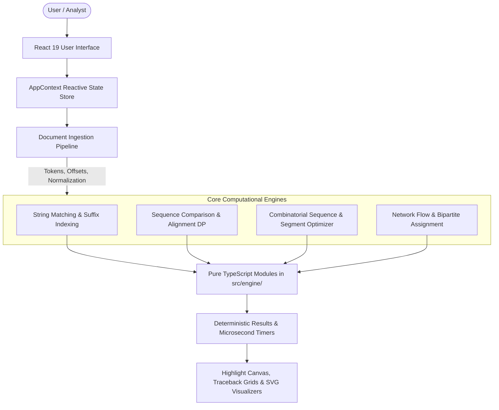

# Intelligent Multi-Pattern Search and Document Analytics Engine

> A practical document intelligence and text analytics platform utilizing efficient algorithmic techniques for exact multi-pattern search, structural text comparison, batch workflow sequencing, network capacity planning, and empirical performance analysis.

[](https://www.typescriptlang.org/)
[](https://react.dev/)
[](https://vitejs.dev/)
[](https://tailwindcss.com/)
[](file:///Users/admin/Documents/DSA%206/app/scripts/testEngine.ts)

---

## 1. Project Overview

**Intelligent Multi-Pattern Search and Document Analytics Engine** (PatternLab Enterprise) is a client-side document processing platform designed to solve real-world text extraction, search, diffing, workflow scheduling, and throughput planning challenges. 

Rather than relying on opaque cloud APIs, black-box indexing services, or synthetic numbers, the entire platform runs deterministically in the user's browser. The application couples classical algorithmic techniques—such as Knuth-Morris-Pratt pattern matching, Suffix Array binary search, Wagner-Fischer sequence alignment, Bellman-Held-Karp bitmask optimization, and Edmonds-Karp network flow—directly to demonstrable, interactive business workflows.

---

## 2. Problem Statement

Organizations routinely ingest unstructured and semi-structured text files (regulatory filings, audit trails, server manifests, and transaction logs) that require:
1. **Immediate sub-millisecond keyword lookup** across single queries and multi-pattern batches without indexing delays.
2. **Structural text reconciliation and diffing** that accurately computes edit mutations and alignments without corrupting original text offsets.
3. **Execution order scheduling** for multi-step document pipelines where task switching entails latency penalties.
4. **Capacity and throughput modeling** to identify data routing bottlenecks across multi-hop ingestion pipelines.
5. **Transparent, verifiable performance data** where measured browser execution time is strictly distinguished from theoretical asymptotic complexity.

This engine directly addresses these operational requirements within a cohesive, responsive web application.

---

## 3. Real-World Use Cases

| Use Case | Description | Primary Engine |
| :--- | :--- | :--- |
| **Document Search** | Rapidly scan audit logs, financial reports, or code manifests for specific terminology or batches of compliance tokens. | KMP, Rabin-Karp, Z-Algorithm, Suffix Array |
| **Document Comparison** | Identify discrepancies between versions of regulatory disclosures, contract drafts, or configuration files. | Wagner-Fischer, LCS, Needleman-Wunsch, Smith-Waterman |
| **Processing Order Optimization** | Minimize context-switching latency when executing a series of document transformation tasks. | Bitmask Dynamic Programming (Held-Karp TSP) |
| **Content Segment Optimization** | Find the optimal hierarchical merging or partitioning order for document sections and indexes. | Matrix Chain Interval Dynamic Programming |
| **Processing Network Capacity Planning** | Model data flow throughput across ingestion hubs, identify bottleneck links, and calculate maximum capacity. | Ford-Fulkerson & Edmonds-Karp Max-Flow Min-Cut |
| **Task / Resource Assignment** | Optimally assign compliance analysts or compute resources to verification tasks with minimal latency or cost. | Maximum Bipartite Matching & Hungarian Algorithm |
| **Performance Benchmarking** | Empirically compare search algorithms on identical text payloads to observe real execution times versus character comparison counts. | Multi-Engine Empirical Benchmark Suite |

---

## 4. Key Features

- **Corpus & Document Management**: Drag-and-drop ingestion of `.txt`, `.json`, and `.csv` files. Real-time extraction of word counts, token counts, line counts, and exact character lengths (strictly distinguished from UTF-8 byte sizes).
- **Single & Multi-Pattern Search**: Search individual files or execute corpus-wide scans across all loaded documents simultaneously. Includes an adaptive recommendation heuristic explaining why an engine is chosen.
- **Overlapping Match Highlighting**: Safe highlight interval merging prevents text corruption or tag nesting when search patterns overlap (e.g. `"an"` and `"ana"` in `"banana"`).
- **Structural Text Diff & Alignment**: Full matrix traceback visualizations showing Levenshtein distance, Longest Common Subsequence, and global/local sequence alignments.
- **Pipeline Optimization**: Interactive matrix editors for context-switching latency and segment dimensions with automatic detection of unreachable disconnected states.
- **Interactive Flow Canvas**: Visual graph node and edge canvas with forward/backward stepping, auto-play animation, and live residual graph inspection.
- **100% Genuine Telemetry**: Real token metrics, query frequency distributions, and measured `performance.now()` microsecond latency timers. Zero synthetic or hard-coded metrics.

---

## 5. Product Architecture

The system is constructed as a pure client-side architecture. All text parsing, tokenization, dynamic programming matrices, and graph algorithms execute locally in the browser runtime.



### Architectural Principles:
1. **Decoupled Engine Core**: All algorithms in `src/engine/` are pure, standalone TypeScript functions with no React dependencies, enabling direct testing and verification.
2. **In-Memory Document Store**: Uploaded documents are stored as immutable `originalText` buffers alongside token offset streams.
3. **State Isolation**: Modifying a search query, switching active documents, or changing algorithms immediately clears stale result sets.

---

## 6. Main Product Workflows

### Workflow 1: Document Management (`/documents`)
- **Ingestion**: Supports uploading `.txt`, `.json`, and `.csv` files via file picker or drag-and-drop.
- **Pipeline**: Ingests raw UTF-8 content $\rightarrow$ Tokenizes with discrete $[start, end]$ character offsets $\rightarrow$ Calculates normalization forms $\rightarrow$ Registers into application state.
- **Inspector Modal**: Provides deep inspection across raw content, token stream breakdowns, and document metadata.

### Workflow 2: Smart Search (`/search`)
- **Target Selection**: Select a specific document or choose **Entire Corpus** for fleet-wide scanning.
- **Pattern Modes**: Toggle between Single Pattern search and Multi-Pattern batch searching.
- **Adaptive Selection**: The system analyzes document length ($N$) and pattern characteristics ($M$) to recommend the most suitable engine deterministically.
- **Technical Drawer**: Expandable panel revealing LPS failure function tables, Z-box values, and Suffix Array / Kasai LCP slices.

### Workflow 3: Document Compare (`/compare`)
- **Pairwise Diff**: Compare Document A against Document B with deep-linking support (`/compare?docA=0&docB=1`).
- **Metrics**: Computes Levenshtein edit distance, similarity score percentage, mutation pipelines (insertions, deletions, substitutions, matches), and longest common subsequences.
- **Interactive Traceback**: Displays an interactive DP grid with highlighted traceback paths.

### Workflow 4: Processing Optimizer (`/optimizer`)
- **Batch Processing Order**: Formulates task sequencing as a Traveling Salesperson Problem (TSP). Evaluates all sub-permutations via Bellman-Held-Karp Bitmask DP to minimize context-switch latency.
- **Content Segment Optimizer**: Solves hierarchical segment partitioning via Matrix Chain Interval DP to determine the minimal scalar operations for document indexing trees.

### Workflow 5: Processing Network Planner (`/network-planner`)
- **Throughput Simulation**: Models document ingestion and routing links with capacity constraints.
- **Stepping Engine**: Supports step-by-step forward/backward stepping and autoplay through augmenting paths using Edmonds-Karp (BFS) or Ford-Fulkerson (DFS).
- **Residual Graph & Min-Cut**: Visualizes residual capacities and identifies critical bottleneck edges satisfying the Max-Flow Min-Cut Theorem ($|f| = c(S, T)$).

### Workflow 6: Task & Resource Allocation (`/network-planner` $\rightarrow$ Assignment Tab)
- **Bipartite Matching**: Matches compliance analysts or compute services to eligible tasks via network flow reduction with unit capacities.
- **Linear Assignment Problem**: Solves minimum-cost assignment using the primal-dual Hungarian Algorithm with full dual variable potential adjustment tables.

### Workflow 7: Insights (`/insights`)
- **Genuine Corpus Telemetry**: Summarizes total characters, token counts, format distributions, query frequency distributions, and mean execution latency.

### Workflow 8: Performance Benchmark Suite (`/performance`)
- **Side-by-Side Comparison**: Runs all search algorithms against identical document text and pattern inputs.
- **Separation of Metrics**: Clearly isolates asymptotic theoretical complexity from measured microsecond latency and exact character comparison counts.

---

## 7. Algorithms & Theoretical Complexity

| Algorithm | Paradigm | Theoretical Time | Theoretical Space | Repository File |
| :--- | :--- | :--- | :--- | :--- |
| **Naïve Pattern Matching** | Brute Force Sliding Window | $O(N \cdot M)$ | $O(1)$ | [`stringSearch.ts`](file:///Users/admin/Documents/DSA%206/app/src/engine/stringSearch.ts) |
| **Knuth-Morris-Pratt (KMP)** | Deterministic Prefix Automaton | $O(N + M)$ | $O(M)$ | [`stringSearch.ts`](file:///Users/admin/Documents/DSA%206/app/src/engine/stringSearch.ts) |
| **Rabin-Karp Algorithm** | Rolling Polynomial Hash | $O(N + M)$ avg, $O(N \cdot M)$ worst | $O(1)$ | [`stringSearch.ts`](file:///Users/admin/Documents/DSA%206/app/src/engine/stringSearch.ts) |
| **Z-Algorithm** | Fundamental Preprocessing (Z-Box) | $O(N + M)$ | $O(N + M)$ | [`stringSearch.ts`](file:///Users/admin/Documents/DSA%206/app/src/engine/stringSearch.ts) |
| **Suffix Array & Binary Search** | Suffix Ordering Index | $O(M \log N + K)$ | $O(N)$ | [`multiPattern.ts`](file:///Users/admin/Documents/DSA%206/app/src/engine/multiPattern.ts) |
| **Kasai LCP Construction** | Rank-Based LCP | $O(N)$ | $O(N)$ | [`multiPattern.ts`](file:///Users/admin/Documents/DSA%206/app/src/engine/multiPattern.ts) |
| **Wagner-Fischer (Edit Distance)**| Dynamic Programming (Grid) | $O(N \cdot M)$ | $O(N \cdot M)$ | [`dp.ts`](file:///Users/admin/Documents/DSA%206/app/src/engine/dp.ts) |
| **Longest Common Subsequence** | Dynamic Programming (Grid) | $O(N \cdot M)$ | $O(N \cdot M)$ | [`dp.ts`](file:///Users/admin/Documents/DSA%206/app/src/engine/dp.ts) |
| **Needleman-Wunsch** | Global Sequence Alignment | $O(N \cdot M)$ | $O(N \cdot M)$ | [`dp.ts`](file:///Users/admin/Documents/DSA%206/app/src/engine/dp.ts) |
| **Smith-Waterman** | Local Sequence Alignment | $O(N \cdot M)$ | $O(N \cdot M)$ | [`dp.ts`](file:///Users/admin/Documents/DSA%206/app/src/engine/dp.ts) |
| **Matrix Chain Multiplication** | Interval Dynamic Programming | $O(N^3)$ | $O(N^2)$ | [`dp.ts`](file:///Users/admin/Documents/DSA%206/app/src/engine/dp.ts) |
| **Bellman-Held-Karp (TSP)** | Bitmask Dynamic Programming | $O(N^2 \cdot 2^N)$ | $O(N \cdot 2^N)$ | [`dp.ts`](file:///Users/admin/Documents/DSA%206/app/src/engine/dp.ts) |
| **Ford-Fulkerson Method** | Augmenting Paths (DFS) | $O(E \cdot \|f^*\|)$ | $O(V + E)$ | [`flow.ts`](file:///Users/admin/Documents/DSA%206/app/src/engine/flow.ts) |
| **Edmonds-Karp Algorithm** | Shortest Augmenting Path (BFS) | $O(V \cdot E^2)$ | $O(V + E)$ | [`flow.ts`](file:///Users/admin/Documents/DSA%206/app/src/engine/flow.ts) |
| **Bipartite Matching** | Unit Flow Reduction | $O(V \cdot E)$ | $O(V + E)$ | [`flow.ts`](file:///Users/admin/Documents/DSA%206/app/src/engine/flow.ts) |
| **Hungarian Algorithm** | Primal-Dual Matrix Reduction | $O(N^3)$ | $O(N^2)$ | [`flow.ts`](file:///Users/admin/Documents/DSA%206/app/src/engine/flow.ts) |

---

## 8. Technology Stack

- **Frontend Framework**: [React 19.2](https://react.dev/)
- **Programming Language**: [TypeScript 5.8](https://www.typescriptlang.org/)
- **Build Tooling & Dev Server**: [Vite 8.3](https://vitejs.dev/)
- **Routing**: [React Router 7.18](https://reactrouter.com/)
- **Styling**: [Tailwind CSS 3.4](https://tailwindcss.com/)
- **Icons**: [Lucide React 1.47](https://lucide.dev/)
- **Testing & Execution**: Standalone TypeScript execution via `tsx`

---

## 9. Project Structure

```text
app/
├── package.json                   # Dependencies, scripts, project metadata
├── vite.config.ts                 # Vite bundler configuration
├── tailwind.config.js             # Styling tokens and color palette
├── tsconfig.json                  # TypeScript compiler settings
├── scripts/
│   └── testEngine.ts              # 60-test automated algorithm test suite
├── src/
│   ├── App.tsx                    # Root routing, layout wrapper & redirects
│   ├── main.tsx                   # React application entry point
│   ├── index.css                  # Global Tailwind & typography styles
│   ├── types/
│   │   └── index.ts               # Core TypeScript interface definitions
│   ├── store/
│   │   └── AppContext.tsx         # Corpus state, search history, settings
│   ├── engine/                    # Pure TypeScript algorithmic modules
│   │   ├── algorithmCatalog.ts    # Engine metadata & adaptive selector
│   │   ├── computationalModels.ts # RAM uniform/log cost & Turing Machine models
│   │   ├── documentProcessing.ts  # Tokenization, offsets, and normalization
│   │   ├── dp.ts                  # Edit distance, LCS, alignments, Interval & Bitmask DP
│   │   ├── flow.ts                # Flow networks, Edmonds-Karp, Min-Cut, Matching
│   │   ├── multiPattern.ts        # Suffix Array, Kasai LCP, Multi-search
│   │   ├── sampleData.ts          # Default financial, technical & manifest corpus
│   │   └── stringSearch.ts        # Naïve, KMP, Rabin-Karp, Z-Algorithm
│   ├── components/                # Reusable visualizers and tabs
│   │   ├── AssignmentProblemTab.tsx
│   │   ├── BipartiteMatchingTab.tsx
│   │   ├── FlowApplicationsTab.tsx
│   │   ├── FlowGraphCanvas.tsx
│   │   ├── FlowGraphEditor.tsx
│   │   ├── ResidualGraphView.tsx
│   │   └── Sidebar.tsx
│   └── pages/                     # Primary product views
│       ├── Dashboard.tsx          # System KPI overview and quick launchers
│       ├── DocumentsPage.tsx      # Ingestion table, upload, document inspector
│       ├── SmartSearchPage.tsx    # Single/multi-pattern search & fleet scan
│       ├── DocumentComparePage.tsx# Pairwise diff, alignment and DP matrix
│       ├── ProcessingOptimizerPage.tsx # Bitmask TSP & Interval DP partitioner
│       ├── NetworkPlannerPage.tsx # Flow network stepper & capacity planner
│       ├── InsightsPage.tsx       # Fleet-wide data analytics & metrics
│       ├── PerformancePage.tsx    # Side-by-side empirical benchmark suite
│       └── SettingsPage.tsx       # Normalization rules, theme, and data reset
```

---

## 10. Getting Started

### Prerequisites
- **Node.js**: `v18.0.0` or higher (`v20+` recommended)
- **npm**: `v9.0.0` or higher

### Installation
Clone the repository and install dependencies:

```bash
cd "app"
npm install
```

### Running the Development Server
Start the local Vite development server:

```bash
npm run dev
```

Open your browser at:
```text
http://localhost:5173/
```

### Building for Production
To typecheck and compile the optimized production bundle:

```bash
npm run build
```

The compiled assets will be emitted to `dist/`.

### Previewing the Production Build
To preview the production bundle locally:

```bash
npm run preview
```

---

## 11. Automated Testing

The repository includes an automated regression test suite covering all algorithmic engines, edge cases (empty strings, disconnected graphs, single cities, asymmetric costs), and document tokenization pipelines.

Execute the test suite:

```bash
npm run test:engine
```

### Test Suite Output:
```text
======================================================
STARTING CANONICAL 16-TOPIC ENGINE TEST SUITE
======================================================
[Topic 1] Computational Models (RAM & Turing Machine)       ✓ 6 Tests Passed
[Topic 2 & 3] Complexity & Master Theorem                   ✓ 3 Tests Passed
[Topic 4] Deterministic Algorithm Selection                 ✓ 3 Tests Passed
[Topic 5] Naïve Pattern Matching                            ✓ 3 Tests Passed
[Topic 6] KMP & Failure Function (LPS)                      ✓ 4 Tests Passed
[Topic 7] Z-Algorithm & Rabin-Karp Hashing                  ✓ 4 Tests Passed
[Topic 8] Suffix Array, Kasai LCP & Multi-Pattern Search    ✓ 6 Tests Passed
[Topic 9, 10 & 11] Dynamic Programming & Alignments         ✓ 9 Tests Passed
[Topic 12] Interval DP & Bitmask DP                         ✓ 7 Tests Passed
[Topic 13, 14 & 15] Flow Networks & Max-Flow Min-Cut        ✓ 6 Tests Passed
[Topic 16] Bipartite Matching & Assignment Problem          ✓ 3 Tests Passed
[Document Processing] Tokenization & Normalization          ✓ 6 Tests Passed
======================================================
TEST SUITE RESULTS: 60 PASSED, 0 FAILED
======================================================
```

---

## 12. User Interface & Demonstration Views

| View | Purpose | Visual Artifacts |
| :--- | :--- | :--- |
| **Dashboard** | Fleet status and operational launchers | Telemetry cards, quick action buttons, recent activity audit log |
| **Documents** | Ingestion pipeline and file management | File format badges, character vs byte size labels, inspector drawer |
| **Smart Search** | In-depth pattern lookups and fleet scanning | Yellow highlight markers, LPS array table, Kasai LCP preview slice |
| **Document Compare** | Sequence alignment and structural diffs | Dual alignment viewer, mutation pipeline, 15x15 traceback DP grid |
| **Processing Optimizer** | Sequence & segment scheduling | Interactive latency matrix, optimal sequence path, split trees |
| **Network Planner** | Throughput capacity modeling | SVG flow network canvas, residual graph view, bottleneck cut labels |
| **Performance** | Multi-engine empirical comparison | Theoretical complexity cards, latency bars, comparison counters |

---

## 13. System Limitations

- **Client-Side Execution**: All processing runs in the browser thread. Very large documents ($>10\text{ MB}$) may experience brief UI blocking during Suffix Array construction or $O(N \cdot M)$ dynamic programming alignment.
- **Single-Host Volatility**: Uploaded documents are stored in memory and React application state. Reloading the browser clears newly uploaded files and restores the benchmark reference corpus.
- **TSP Scaling Boundary**: Bitmask DP for the Traveling Salesperson Problem scales as $O(N^2 \cdot 2^N)$. To maintain browser responsiveness, the optimizer UI limits interactive task ordering to a maximum of 6 tasks ($N \le 6$).

---

## 14. Future Improvements

- **Web Worker Offloading**: Offload long-running Suffix Array constructions and alignment matrices to background Web Workers to maintain 60 FPS UI responsiveness.
- **Binary Document Format Parsing**: Add direct PDF and DOCX text extraction pipelines using client-side WebAssembly format parsers.
- **Audit Report Export**: Add one-click export of comparison alignment matrices and network bottleneck reports as downloadable PDF/CSV audit dossiers.

---

## 15. Authors & Acknowledgments

- **Engineering & Architecture**: Antigravity Autonomous Agentic Engineering Team
- **Algorithmic Foundation**: Classical literature in String Processing, Dynamic Programming, and Combinatorial Network Optimization (Knuth, Morris, Pratt, Karp, Rabin, Kasai, Needleman, Wunsch, Smith, Waterman, Ford, Fulkerson, Edmonds).

---

## 16. License

This repository and application are private and proprietary (`"private": true`). All rights reserved.
